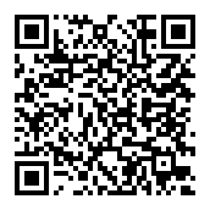

# fc3ds  
### FBI QR Code: 

  
Browse, preview and install 3DS system fonts on the console, over the network.
Native homebrew — devkitARM, libctru, citro2d.

Pick one of ~1800 Google Fonts families, see it drawn on the top screen, and
install it. The whole conversion happens on the console

**Installing writes to NAND.** so just like... be careful? don't come running 
to me if you break something

## Building

```sh
make                          # fc3ds.3dsx
make test                     # host-side unit tests, no devkitARM involved
make run THREEDS_IP=1.2.3.4   # 3dslink to a console running netloader
make cia                      # needs bannertool and makerom
```

Portlibs: `pacman -S 3ds-curl 3ds-mbedtls 3ds-zlib 3ds-freetype`.

Vendored in `vendor/`: [cJSON](https://github.com/DaveGamble/cJSON) (MIT),
[quirc](https://github.com/dlbeer/quirc) (ISC) and
[ctr-osk-rt](https://github.com/cmdada/ctr-osk-rt) (GPL-3.0), the touch
keyboard Settings can switch to.

## License

GPL-3.0. See [LICENSE](LICENSE).
